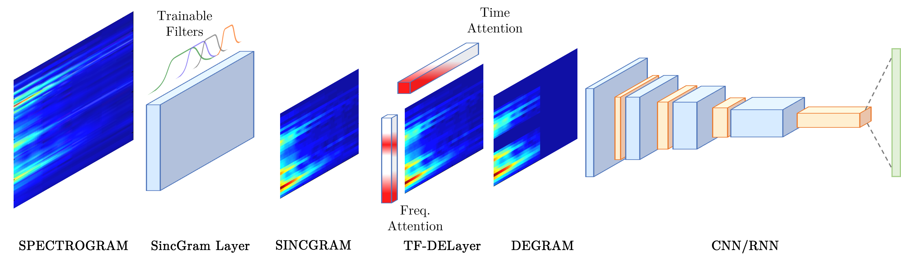

# DEGramNet
# DEGramNet: Effective audio analysis based on a fully learnable time-frequency representation

This repository contains the code related to the paper "DEGramNet: Effective audio analysis based on a fully learnable time-frequency representations".

The code will be uploaded immediately after the paper acceptance.

